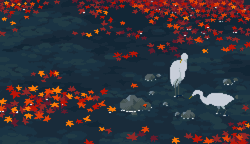

<h1 align="center"> I'm Valentina</h1> 

  
🔬 Science enthusiast

  
🌱 Currently learning Python

  
🍄 Computer Science student at Universidad Nacional de La Plata, Argentina.

  
     

  
  *** 
   

  #### 📩 <b>How to reach me:</b>  [valentinawiehl.dev@gmail.com](mailto:valentinawiehl.dev@gmail.com) 
   
  

 

  
  
  

  

